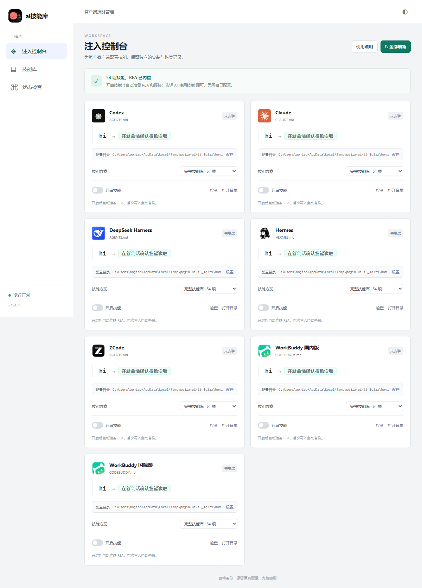

# ai技能库

**开发方式：AI 开发。**

Windows 桌面技能管理工具，当前版本 **1.3.2**。支持 Codex、Claude、DeepSeek Harness、Hermes、ZCode，以及 WorkBuddy 国内版和国际版。



## 功能

- 内置 53 项技能、50 项扩展技能，以及基础与进阶方案。
- 安装、切换、检查与撤销技能；写入前自动备份，保留已有配置和外部修改。
- 导入 Markdown、含 `SKILL.md` 的文件夹或单技能 ZIP，保留附带资源。
- 搜索、分类筛选、浅色与深色主题，完整页面和技能正文支持滚动。
- 自定义图标与约 7 秒启动动画。动画静音铺满软件窗口，无跳过按钮；播放时隐藏标题栏，结束后恢复窗口控制按钮。
- 本地运行，无账户、订阅或反馈页面，无需连接原服务器。

## 下载与运行

在本仓库的 **Releases** 下载 `AISkillLibrary-1.3.2-windows-x64.zip`，解压后双击 `ai技能库.exe`。
也可以直接下载 `AISkillLibrary-1.3.2-windows-x64.exe` 运行。

系统需要 Windows x64 与 Microsoft Edge WebView2 Runtime。运行已打包版本无需安装 Python。

1. 确认客户端卡片上的配置目录，必要时在设置中选择实际目录。
2. 选择技能方案并开启对应客户端开关。
3. 点击“检查”确认文件完整，再重启客户端或新建会话确认模型读取。
4. 关闭开关可撤销；已有文件被外部修改时保留修改并报告冲突。

支持的配置位置、导入格式和备份恢复方式见 [使用说明](docs/USAGE.md)。
文件检查通过与模型实际读取是两个不同状态；模块提到的工具需在本机另行核对。

## 从源码运行

本次构建与验收使用 Windows x64、Python 3.14。详细步骤见 [构建说明](docs/BUILD.md)。

```powershell
python -m venv .venv
.\.venv\Scripts\python.exe -m pip install -r requirements.txt
.\.venv\Scripts\python.exe main.py
```

## 测试与构建

```powershell
.\.venv\Scripts\python.exe tests/test_local.py
powershell -NoProfile -ExecutionPolicy Bypass -File .\build.ps1
```

构建输出为 `dist/AISkillLibrary.exe`。版本由 `backend.py`、`version_info.txt` 与前端显示共同定义。
[验收记录](docs/VERIFICATION.md) 和 [更新说明](CHANGELOG.md) 说明当前版本的验证范围。

## 逆向与安全分析

[v1.3.2 逆向与安全报告](docs/security/REVERSE_ANALYSIS.md)公开样本 SHA-256、EXE/源码对照、Defender 定点扫描、运行观察与原始证据。
该报告是 AI 协助的项目自审，结论限定检查范围；本机代理、未签名和第三方依赖限制在正文中说明。
[复现检查](docs/security/REPRODUCE.md)。

## 项目结构

```text
main.py                 Windows 窗口与本地 HTTP 服务
backend.py              技能管理、备份和撤销
frontend/               界面、图标与启动动画
skills/                 内置与扩展技能正文、索引
tests/                  集成测试与浏览器验收
docs/                   使用、构建与验证说明
build.ps1               Windows EXE 构建入口
```

资源来源和第三方许可说明见 [NOTICE.md](NOTICE.md)。
